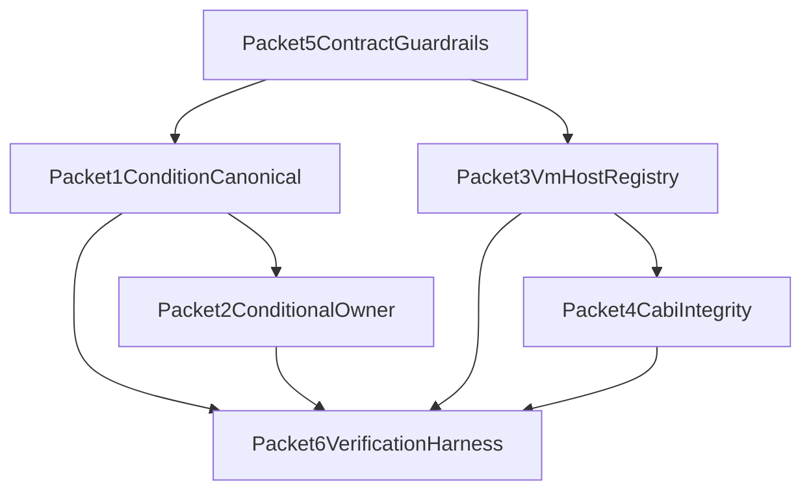

# Zero-Gap Compliance Manifest

This document is a strict execution manifest. Agents do not pass unless every required gate is satisfied.

Scope:

- `tsz/compiler`
- `tsz/framework`

Architecture authority:

- `tsz/docs/ARCHITECTURE.md`
- `tsz/docs/compiler-framework-reuse-audit.md`

Non-negotiable outcome:

- Modular code, no spaghetti, no god-file growth.
- Behavior identical to pre-refactor output/runtime behavior unless explicitly approved.

---

## Global Completion Contract

A packet is considered **FAILED** if any one condition is true:

- Any out-of-scope file was edited.
- Any behavior drift is observed in targeted verification.
- Any required parity check is missing or fails.
- Any duplicate canonical helper still exists in allowed scope.
- Any new large orchestrator-style logic block is introduced.
- Any agent claims completion without artifact evidence.

A packet is considered **COMPLETE** only when:

- All checklist items are checked and evidenced.
- All required commands/tests pass.
- Required evidence artifacts are attached.
- Coordinator signs off after independent verification.

---

## Hard Anti-Spaghetti Constraints

1. One seam per packet. No cross-seam opportunistic refactors.
2. No logic centralization into orchestrator files.
3. Shared logic must move to narrow utility modules with single responsibility.
4. Any function that touches multiple architecture layers must be split into adapters.
5. Existing public names/signatures stay stable unless explicitly specified in packet.
6. New module must include ownership header comment (what it owns, what it does not own).

God-file thresholds (enforced manually by reviewer):

- Reject any change that materially increases cognitive density of an orchestration file.
- Reject any file that becomes a mixed-concern sink for parsing + emit + runtime glue.

---

## Behavior Preservation Invariants (Must Hold)

Compiler invariants:

- Generated Zig semantics for condition wrapping are unchanged.
- `show_hide` and `ternary_jsx` emit behavior remains identical.
- Map/non-map conditional filters retain previous behavior.

Runtime invariants:

- Shared host APIs remain name/arity compatible across Lua and QJS where declared shared.
- VM-specific APIs remain VM-specific (no false parity).
- C-ABI boundary (`rjit_`*) remains link-compatible with `api.zig` externs.

Cross-VM invariants:

- `__markDirty`, `__setState`, `__getState`, input/mouse/telemetry core host paths remain callable.
- No regressions in Lua<->QJS sync bridge operations.

---

## Required Evidence Artifacts (Per Packet)

Each packet must produce all of:

- `CHANGED_FILES.md`: exact list of touched files and why.
- `INVARIANT_CHECKLIST.md`: each invariant with pass/fail and proof.
- `TEST_EVIDENCE.md`: commands run, outputs summarized, failures (if any).
- `DRIFT_REPORT.md`: explicit statement of whether behavior drift was detected.

If any artifact is missing, packet is rejected.

---

## Packet Manifest Entries

## Packet 1: Condition Canonicalization

**ID**: `P1_CONDITION_CANONICAL`

**Allowed files (strict)**

- `tsz/compiler/smith/emit_ops/emit_display_toggle.js`
- `tsz/compiler/smith/emit_ops/rebuild_map.js`
- `tsz/compiler/smith/emit/runtime_updates.js`
- `tsz/compiler/smith/emit_atoms/logic_runtime/a036_conditional_updates.js`
- `tsz/compiler/smith/emit_atoms/maps_zig/a019_map_metadata.js`
- Optional: one new helper file under `tsz/compiler/smith/emit_ops/`

**Must deliver**

- One canonical condition wrapper implementation.
- One canonical display-toggle emitter implementation.
- All scoped callers migrated to canonical implementation.

**Must not**

- Change parser behavior.
- Change lane dispatch behavior.
- Touch runtime Zig code.

**Blocking gates**

- No duplicate wrapper logic left in scoped files.
- Conformance cases for map + non-map conditionals pass.
- Drift report says semantic output unchanged.

---

## Packet 2: Conditional Ownership Convergence

**ID**: `P2_CONDITIONAL_OWNER`

**Allowed files (strict)**

- `tsz/compiler/smith/emit/runtime_updates.js`
- `tsz/compiler/smith/emit_atoms/logic_runtime/a036_conditional_updates.js`
- `tsz/compiler/smith/emit_atoms/index.js`
- Optional: one small adapter in `tsz/compiler/smith/emit_ops/`

**Must deliver**

- Exactly one canonical owner for `_updateConditionals` behavior.
- Secondary path reduced to adapter/delegation only.

**Must not**

- Duplicate condition branch emit logic in two owners.
- Modify map rebuild internals.

**Blocking gates**

- Plain/ternary/in-map conditional test matrix passes.
- No divergent branch-filter behavior between old split paths.

---

## Packet 3: Cross-VM Host Registry

**ID**: `P3_VM_HOST_REGISTRY`

**Allowed files (strict)**

- `tsz/framework/qjs_runtime.zig`
- `tsz/framework/luajit_runtime.zig`
- Optional new module: `tsz/framework/vm_host_registry.zig`

**Must deliver**

- Descriptor-driven shared host registration model.
- Shared host API descriptor set for common operations.
- VM-specific extension descriptors with explicit availability flags.

**Must not**

- Change host function semantics.
- Force VM-only APIs into cross-VM shared set.

**Blocking gates**

- Shared host names/arity parity check passes.
- Runtime init path still registers all previously available host functions.

---

## Packet 4: C-ABI Surface Integrity

**ID**: `P4_CABI_INTEGRITY`

**Allowed files (strict)**

- `tsz/framework/core.zig`
- `tsz/framework/api.zig`
- Optional checker in `tsz/scripts/`

**Must deliver**

- Normalized namespace-grouped wrapper organization.
- Automated parity validation between `api.zig` externs and `core.zig` exports.

**Must not**

- Rename/remove `rjit_`* symbols without matching coordinated update.
- Alter engine/state semantics.

**Blocking gates**

- Zero missing symbols.
- Zero stale symbols.
- Existing cart link path succeeds.

---

## Packet 5: Pattern/Atom Contract Enforcement

**ID**: `P5_CONTRACT_GUARDRAILS`

**Allowed files (strict)**

- `tsz/compiler/smith/patterns/index.js`
- `tsz/compiler/smith/emit_atoms/index.js`
- `tsz/compiler/smith/FUNCTIONS_MANIFEST.md`
- Optional check script in `tsz/scripts/`

**Must deliver**

- Explicit contract rules for pattern and atom ownership boundaries.
- Duplicate canonical helper detection check.
- Manifest ownership updates for moved/shared helpers.

**Must not**

- Add runtime behavior changes.
- Add expensive/non-deterministic checks.

**Blocking gates**

- Contract check fails on duplicate canonical helper names.
- Ownership manifest matches final helper ownership.

---

## Packet 6: Verification Harness

**ID**: `P6_VERIFICATION_HARNESS`

**Allowed files (strict)**

- `tsz/tests/` (or existing conformance harness locations)
- `tsz/scripts/conformance-report`
- `tsz/scripts/flight-check` (only if needed)

**Must deliver**

- Deterministic test coverage for condition wrapping matrix:
  - comparison
  - raw i64 truthiness
  - negation
  - eval-based expressions
- Cross-VM shared host API parity checks.
- Packet-attributed failure report.

**Must not**

- Edit compiler/runtime implementation files.

**Blocking gates**

- Tests clearly fail before and pass after target packet changes (when applicable).
- Report identifies owning packet for each failure.

---

## Dependency Graph (Enforced)

Execution order:

1. Parallel start: `P1`, `P3`, `P5`
2. Then `P2` (depends on `P1`)
3. Then `P4` (depends on `P3`)
4. `P6` runs continuously and at each merge gate

---

## Merge Gate Checklist (Coordinator Must Enforce)

For each packet merge:

- Allowed-file whitelist respected.
- Evidence artifacts present and complete.
- Blocking gates all pass.
- Invariants explicitly checked and marked pass.
- No new god-file behavior introduced.
- Independent reviewer confirms no behavior drift.

If any checkbox is false, packet is rejected.

---

## Agent Submission Format (Required)

Every agent must submit:

1. Packet ID
2. Changed files
3. Checklist with pass/fail for each blocking gate
4. Invariant results with proof
5. Known risks or unresolved issues
6. Explicit statement:
  - `NO_DRIFT_CONFIRMED` or `DRIFT_DETECTED`

Submissions missing the explicit drift statement are automatically rejected.